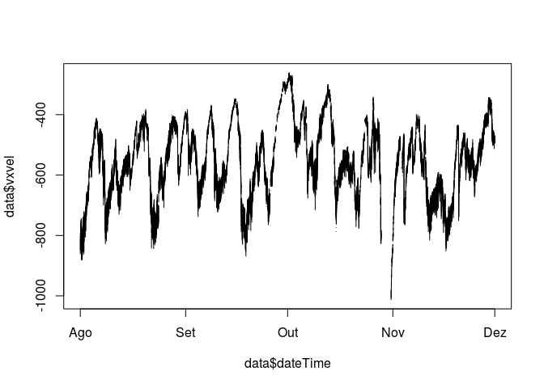

Exploring Geomagnetic Data - Tidying data
================

-   [Data Origin and Objectives](#data-origin-and-objectives)
-   [Understanding Data](#understanding-data)
-   [Importing Data and Changing labels](#importing-data-and-changing-labels)
-   [Date/Hour Conversion](#datehour-conversion)
-   [Ploting Data](#ploting-data)
-   [Removing Unused Variables](#removing-unused-variables)
-   [References](#references)

### Data Origin and Objectives

Interactions between Sun and Earth part of Space Weather, causes social and technological impacts, methods to measure these interactions exists, but sometimes data are made available after the geomagnétic events \[3\]. ACE (Advanced Composition Explorer) satellite was launched by NASA helping to improve forecast of solar winds impacts \[1\]. Geomagnetic index characterize Earth's Geomagnetic Field conditions without the need for massive data manipulation \[2\]. The aim of this work is to find correlation between real-time geomagnetic data from ACE Satellite and AE(Auroral Electroject), Sym-H (Symetric-H) Geomagnetic Index.

This data can be obtained on [SPDF OMNIWeb Plus service website](https://omniweb.gsfc.nasa.gov/):

### Understanding Data

| COLUMN | ITEMS                       | FORMAT |
|--------|-----------------------------|--------|
| 1      | Year                        | I4     |
| 2      | Day                         | I4     |
| 3      | Hour                        | I3     |
| 4      | Minute                      | I3     |
| 5      | Field magnitude average, nT | F8.2   |
| 6      | BX, nT (GSE, GSM)           | F8.2   |
| 7      | BY, nT (GSM)                | F8.2   |
| 8      | BZ, nT (GSM)                | F8.2   |
| 9      | Speed, km/s                 | F8.1   |
| 10     | Vx Velocity,km/s            | F8.1   |
| 11     | Proton Density, n/cc        | F7.2   |
| 12     | Temperature, K              | F9.0   |
| 13     | Flow pressure, nPa          | F6.2   |
| 14     | Electric field, mV/m        | F7.2   |
| 15     | Total Plasma beta           | F7.2   |
| 16     | AE-index, nT                | I6     |
| 17     | SYM/H, nT                   | I6     |
| 18     | ASY/H, nT                   | I6     |
| 19     | PCN-index                   | F7.2   |

### Importing Data and Changing labels

``` r
setwd("~/Dropbox/Mestrado/CAP-386-Introduction-To-Data-Science/project/data")
data = read.table("data20030801to20031130.txt")
colnames(data) <- c("year", "day", "hour", "minute", "fma", "bx", "by", "bz", "speed", "vxvel", "pd", "temp", "flowpres", "electricfield", "tpb", "ae", "symh", "asyh", "pcn")

head(data)
```

    ##   year day hour minute  fma    bx   by    bz speed  vxvel   pd   temp
    ## 1 2003 213    0      0 6.89 -3.79 5.10 -1.14 815.7 -814.7 1.65 296709
    ## 2 2003 213    0      1 6.94 -2.40 5.54 -1.41 862.1 -861.1 1.70 292880
    ## 3 2003 213    0      2 6.94 -3.20 4.81 -2.96 802.8 -802.3 1.97 333668
    ## 4 2003 213    0      3 7.06 -2.96 4.08 -4.89 810.5 -809.2 1.92 320004
    ## 5 2003 213    0      4 7.05 -2.91 3.20 -5.51 817.3 -815.2 1.85 309686
    ## 6 2003 213    0      5 7.02 -2.42 3.79 -5.14 817.6 -815.7 1.60 316902
    ##   flowpres electricfield  tpb   ae symh asyh  pcn
    ## 1     2.20          0.93 0.61 1066  -25   64 4.13
    ## 2     2.53          1.22 0.62 1098  -24   69 4.15
    ## 3     2.54          2.38 0.79 1149  -24   71 4.20
    ## 4     2.52          3.96 0.72 1136  -23   70 4.26
    ## 5     2.47          4.50 0.68 1153  -22   71 4.42
    ## 6     2.14          4.20 0.60 1113  -22   72 4.41

### Date/Hour Conversion

In this data set, measurements are taken in intervals of minutes, producing time series. It's not possible to represent time series in the current format (Year, day of Year, Hour and Minute). We can solve this creating a date/time column.

``` r
data$dateTime <- strptime(paste(data$year, data$day, data$hour, data$minute), format="%Y %j %H %M")

head(data)
```

    ##   year day hour minute  fma    bx   by    bz speed  vxvel   pd   temp
    ## 1 2003 213    0      0 6.89 -3.79 5.10 -1.14 815.7 -814.7 1.65 296709
    ## 2 2003 213    0      1 6.94 -2.40 5.54 -1.41 862.1 -861.1 1.70 292880
    ## 3 2003 213    0      2 6.94 -3.20 4.81 -2.96 802.8 -802.3 1.97 333668
    ## 4 2003 213    0      3 7.06 -2.96 4.08 -4.89 810.5 -809.2 1.92 320004
    ## 5 2003 213    0      4 7.05 -2.91 3.20 -5.51 817.3 -815.2 1.85 309686
    ## 6 2003 213    0      5 7.02 -2.42 3.79 -5.14 817.6 -815.7 1.60 316902
    ##   flowpres electricfield  tpb   ae symh asyh  pcn            dateTime
    ## 1     2.20          0.93 0.61 1066  -25   64 4.13 2003-08-01 00:00:00
    ## 2     2.53          1.22 0.62 1098  -24   69 4.15 2003-08-01 00:01:00
    ## 3     2.54          2.38 0.79 1149  -24   71 4.20 2003-08-01 00:02:00
    ## 4     2.52          3.96 0.72 1136  -23   70 4.26 2003-08-01 00:03:00
    ## 5     2.47          4.50 0.68 1153  -22   71 4.42 2003-08-01 00:04:00
    ## 6     2.14          4.20 0.60 1113  -22   72 4.41 2003-08-01 00:05:00

### Ploting Data

Let's see how the "Field Magnitude average" looks:

``` r
plot(data$dateTime, data$fma, type ='l')
```


The data look like a mess! We need to clean it before.

#### Cleaning FMA

In the "Field Magnitude average" Column, the greatest value is 9999.99, let's remove it and see how the data looks.

``` r
data$fma[data$fma>=9999]<-NaN
plot(data$dateTime, data$fma, type ='l')
```


Now "FMA" looks like a time serie. Let's do it to all columns.

#### Cleaning BX

``` r
data$bx[data$bx>=9999]<-NaN
plot(data$dateTime, data$bx, type ='l')
```


#### Cleaning BY

``` r
data$by[data$by>=9999]<-NaN
plot(data$dateTime, data$by, type ='l')
```


#### Cleaning BZ

``` r
data$bz[data$bz>=9999]<-NaN
plot(data$dateTime, data$bz, type ='l')
```

 \#\#\#\# Cleaning Velocity

``` r
data$vxvel[data$vxvel>=9999]<-NaN
plot(data$dateTime, data$vxvel, type ='l')
```



#### Cleaning Proton Density

``` r
data$pd[data$pd>=999]<-NaN
plot(data$dateTime, data$pd, type ='l')
```


#### Cleaning Temperature

``` r
data$temp[data$temp>=9999999]<-NaN
plot(data$dateTime, data$temp, type ='l')
```


#### Cleaning AE

``` r
data$ae[data$ae>=9999]<-NaN
plot(data$dateTime, data$ae, type ='l')
```

 \#\#\#\# Cleaning Sym-H

``` r
data$symh[data$symh>=9999]<-NaN
plot(data$dateTime, data$symh, type ='l')
```

 \#\#\#\# Cleaning Sym-H

``` r
data$asyh[data$asyh>=9999]<-NaN
plot(data$dateTime, data$asyh, type ='l')
```


### Removing Unused Variables

Following the aim of this project, we will remove the unused variables, holding the tidy data.

``` r
data$year <- NULL
data$day <- NULL
data$hour <- NULL
data$minute <- NULL
data$fma <- NULL
data$speed <- NULL
data$flowpres <- NULL
data$electricfield <- NULL
data$tpb <- NULL
data$pcn <- NULL

head(data)
```

    ##      bx   by    bz  vxvel   pd   temp   ae symh asyh            dateTime
    ## 1 -3.79 5.10 -1.14 -814.7 1.65 296709 1066  -25   64 2003-08-01 00:00:00
    ## 2 -2.40 5.54 -1.41 -861.1 1.70 292880 1098  -24   69 2003-08-01 00:01:00
    ## 3 -3.20 4.81 -2.96 -802.3 1.97 333668 1149  -24   71 2003-08-01 00:02:00
    ## 4 -2.96 4.08 -4.89 -809.2 1.92 320004 1136  -23   70 2003-08-01 00:03:00
    ## 5 -2.91 3.20 -5.51 -815.2 1.85 309686 1153  -22   71 2003-08-01 00:04:00
    ## 6 -2.42 3.79 -5.14 -815.7 1.60 316902 1113  -22   72 2003-08-01 00:05:00

``` r
setwd("~/Dropbox/Mestrado/CAP-386-Introduction-To-Data-Science/project/data")
write.csv(data, file = "tidygeomagdata.csv")
```

### References

\[1\] Advanced Composition Explorer(ACE), <http://www.srl.caltech.edu/ACE/>.

\[2\] KIVELSON, Margaret G; RUSSELL, Christopher T. Introduction to space physics, Cambridge university press, 1995.

\[3\] SEO, R. T. Aplicação Para Representação Gráfica de Variáveis Relacionadas a Perturbações Geomagnéticas, 2016.
