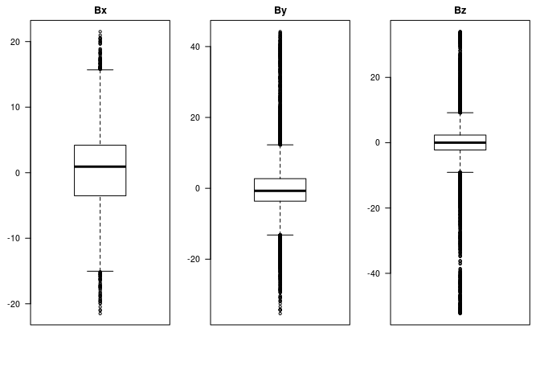
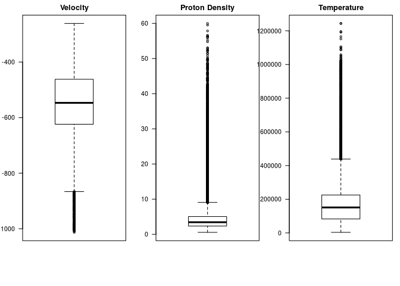
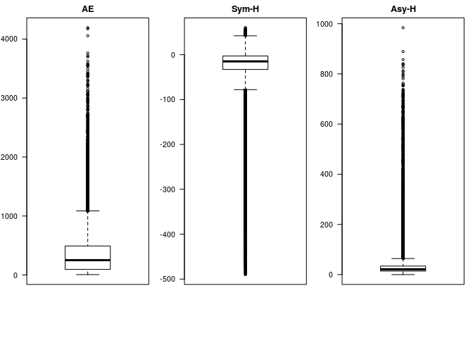

Exploring Geomagnetic Data - Statistics Overview
================

-   [Importing Data](#importing-data)
-   [BoxPlot](#boxplot)
-   [References](#references)

### Importing Data

``` r
setwd("~/Dropbox/Mestrado/CAP-386-Introduction-To-Data-Science/project/data")
data = read.table("tidygeomagdata.csv", header = TRUE, sep=",")

head(data)
```

    ##   X    bx   by    bz  vxvel   pd   temp   ae symh asyh            dateTime
    ## 1 1 -3.79 5.10 -1.14 -814.7 1.65 296709 1066  -25   64 2003-08-01 00:00:00
    ## 2 2 -2.40 5.54 -1.41 -861.1 1.70 292880 1098  -24   69 2003-08-01 00:01:00
    ## 3 3 -3.20 4.81 -2.96 -802.3 1.97 333668 1149  -24   71 2003-08-01 00:02:00
    ## 4 4 -2.96 4.08 -4.89 -809.2 1.92 320004 1136  -23   70 2003-08-01 00:03:00
    ## 5 5 -2.91 3.20 -5.51 -815.2 1.85 309686 1153  -22   71 2003-08-01 00:04:00
    ## 6 6 -2.42 3.79 -5.14 -815.7 1.60 316902 1113  -22   72 2003-08-01 00:05:00

### BoxPlot

``` r
par(mfrow=c(1,3),mar=c(6,3,2,1))
boxplot(data$bx, main="Bx",las=2)
boxplot(data$by, main="By",las=2)
boxplot(data$bz, main="Bz",las=2)
```



``` r
par(mfrow=c(1,3),mar=c(6,3,2,1))
boxplot(data$vxvel, main="Velocity",las=2)
boxplot(data$pd, main="Proton Density",las=2)
boxplot(data$temp, main="Temperature",las=2)
```



``` r
par(mfrow=c(1,3),mar=c(6,3,2,1))
boxplot(data$ae, main="AE",las=2)
boxplot(data$symh, main="Sym-H",las=2)
boxplot(data$asyh, main="Asy-H",las=2)
```



### References

\[1\] Advanced Composition Explorer(ACE), <http://www.srl.caltech.edu/ACE/>.

\[2\] KIVELSON, Margaret G; RUSSELL, Christopher T. Introduction to space physics, Cambridge university press, 1995.

\[3\] SEO, R. T. Aplicação Para Representação Gráfica de Variáveis Relacionadas a Perturbações Geomagnéticas, 2016.
